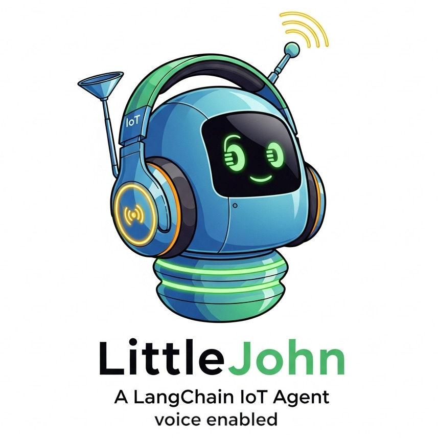

# Little John A LangChain IoT Agent

A Python-based voice assistant project that processes voice commands and performs various actions, built with LangChain 1.0.

<div align="center">
  
</div>

## Description

This project implements a **ReAct Agent** that can:
- Listen to voice commands and respond to the user by voice
- Process natural language locally
- Execute tasks based on voice input

## Core Features

-    **Push-to-Talk Activation:** The agent is not always listening. It activates only when a button is pressed (P2T), giving the user full control over input.

-    **Local Speech-to-Text:** Voice input is transcribed into text using a locally running instance of Whisper, ensuring that audio data never leaves the device.

-   **Logical Orchestration (Agent):** The core of the agent is built on LangChain 1.0. This allows it to understand user intent (NLP) and orchestrate complex tasks.

-   **Tool Execution:** The agent is capable of executing tangible actions, such as controlling LED lights via a dedicated API server (requires configuration).

-   **Local Text-to-Speech:** Responses generated by LangChain are converted back into audio using a local speech synthesizer, completing the voice interaction loop.
  

### Full Video Demo
[](https://drive.google.com/file/d/1tecC2FuBbb7S7qHkVKTTYiEA0oQKHGUQ/preview)

## Installation

```bash
#On your machine
git clone https://github.com/LorenzoSiena/Little-John--A-LangChain-IoT-Agent.git
cd Little-John--A-LangChain-IoT-Agent
uv sync
```

```bash
#On the api led server (Optional)
pip install microdot gpiozero 
```

```bash
#(Optional libraries and other software that might be needed on your system)
sudo apt update
sudo apt install build-essential
sudo apt install python3-dev
sudo apt install linux-headers-$(uname -r)
```

## Configuration

Before running the project, you need to initialize your environment variables:

Create the .env file from .env.example:

```bash
cp .env.example .env
```

Set your Gemini API key in the .env file:

```bash
# your API key
GEMINI_API_KEY=your_gemini_api_key_here

# Optional Whisper model configuration
WHISPER_MODEL="small"
WHISPER_DEVICE="cpu"
WHISPER_COMPUTE_TYPE="int8"

# LED API configuration (if you want to use the LED tool)
LED_API_BASE_URL=http://192.168.1.2:5000/led
```

Make sure you replace your_gemini_api_key_here with your actual Gemini API key.

## Usage
Run the Agent with the gui
```bash
uv run gui.py
```

The LED control server is included in the repository and can be started with:
```bash
python led_server_microdot_raspy.py
```
For this particular example, you need Microdot for the API server and gpiozero to control the LEDs,
which you can find [**here**](https://github.com/miguelgrinberg/microdot) and [**here**](https://github.com/gpiozero/gpiozero).


## Dependencies

- faster-whisper>=1.2.0
- gtts>=2.5.4
- langchain[google-genai]>=1.0.1
- langchain-google-vertexai>=3.0.0
- pygame>=2.6.1
- pynput>=1.8.1
- python-dotenv>=1.1.1
- sounddevice>=0.5.2

## Contributing

Feel free to submit issues and pull requests.

## License

[GNU General Public License v3.0](LICENSE)

## Author

Lorenzo Siena

